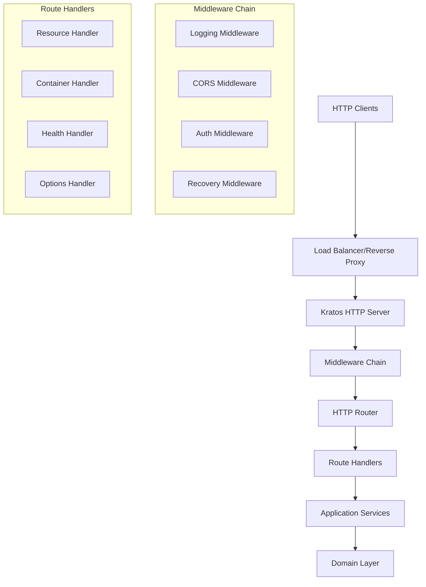

# Design Document: HTTP Server & Basic Routing

## Overview

The HTTP Server & Basic Routing feature provides the foundational web server infrastructure for the Solid pod server using the Go-Kratos framework. This design implements a clean architecture approach with proper separation of concerns, middleware support, and extensible routing capabilities that will serve as the foundation for all Solid protocol operations.

The design leverages Kratos v2.8.0's HTTP transport layer while maintaining compliance with HTTP/1.1 and HTTP/2 standards, providing robust request handling, middleware composition, and graceful shutdown capabilities.

## Architecture

### High-Level Architecture



### Component Architecture

The HTTP server follows standard Kratos application structure:

- **Entry Point**: `cmd/server/main.go` - Application bootstrap and Kratos app initialization
- **Server Factory**: `internal/infrastructure/transport/http/server.go` - HTTP server creation and configuration
- **Handlers**: `internal/infrastructure/transport/http/handlers/` - HTTP request handlers
- **Wire Providers**: Dependency injection setup for server components
- **Configuration**: `configs/` - YAML configuration files

## Components and Interfaces

### 1. Application Entry Point

**Location**: `cmd/server/main.go`

```go
package main

import (
    "flag"
    "os"

    "github.com/go-kratos/kratos/v2"
    "github.com/go-kratos/kratos/v2/config"
    "github.com/go-kratos/kratos/v2/config/file"
    "github.com/go-kratos/kratos/v2/log"
    "github.com/go-kratos/kratos/v2/transport/http"
)

var (
    flagconf = flag.String("conf", "../../configs", "config path, eg: -conf config.yaml")
)

func main() {
    flag.Parse()
    
    c := config.New(
        config.WithSource(
            file.NewSource(*flagconf),
        ),
    )
    
    logger := log.NewStdLogger(os.Stdout)
    
    app, cleanup, err := wireApp(c.Server, logger)
    if err != nil {
        panic(err)
    }
    defer cleanup()
    
    if err := app.Run(); err != nil {
        panic(err)
    }
}

func newApp(logger log.Logger, hs *http.Server) *kratos.App {
    return kratos.New(
        kratos.Name("goro-server"),
        kratos.Version("v1.0.0"),
        kratos.Logger(logger),
        kratos.Server(hs),
    )
}
```

### 2. HTTP Server Factory

**Location**: `internal/infrastructure/transport/http/server.go`

```go
func NewHTTPServer(c *conf.Server, logger log.Logger, healthHandler *HealthHandler) *http.Server {
    var opts = []http.ServerOption{
        http.Address(c.Http.Addr),
        http.Timeout(c.Http.Timeout.AsDuration()),
        http.Middleware(
            recovery.Recovery(),
            logging.Server(logger),
        ),
    }
    
    srv := http.NewServer(opts...)
    srv.Route("/health").GET(healthHandler.Check)
    
    return srv
}
```

**Responsibilities**:
- Create and configure Kratos HTTP server
- Register routes and handlers
- Apply middleware chain

### 3. Wire Dependency Injection

**Location**: `cmd/server/wire.go`

```go
//go:build wireinject
// +build wireinject

package main

import (
    "github.com/go-kratos/kratos/v2"
    "github.com/go-kratos/kratos/v2/log"
    "github.com/google/wire"
)

func wireApp(*conf.Server, log.Logger) (*kratos.App, func(), error) {
    panic(wire.Build(
        newApp,
        NewHTTPServer,
        NewHealthHandler,
    ))
}
```

**Responsibilities**:
- Wire together all application dependencies
- Generate dependency injection code at compile time
- Provide clean separation of concerns

### 3. Kratos Middleware Integration

**Location**: `internal/infrastructure/transport/http/middleware/`

Custom middleware following Kratos v2 patterns:

```go
import (
    "github.com/go-kratos/kratos/v2/middleware"
    "github.com/go-kratos/kratos/v2/middleware/logging"
    "github.com/go-kratos/kratos/v2/middleware/recovery"
    "github.com/go-kratos/kratos/v2/transport/http"
)

// Custom CORS middleware for HTTP transport
func CORS() http.FilterFunc {
    return func(next http.FilterFunc) http.FilterFunc {
        return func(ctx http.Context) error {
            ctx.Response().Header().Set("Access-Control-Allow-Origin", "*")
            ctx.Response().Header().Set("Access-Control-Allow-Methods", "GET,POST,PUT,DELETE,OPTIONS")
            if ctx.Request().Method == "OPTIONS" {
                return ctx.String(200, "")
            }
            return next(ctx)
        }
    }
}

// Custom timeout middleware
func Timeout(timeout time.Duration) middleware.Middleware {
    return func(handler middleware.Handler) middleware.Handler {
        return func(ctx context.Context, req interface{}) (interface{}, error) {
            ctx, cancel := context.WithTimeout(ctx, timeout)
            defer cancel()
            return handler(ctx, req)
        }
    }
}
```

**Core Middleware Components**:
- **Built-in Recovery**: `recovery.Recovery()` for panic handling
- **Built-in Logging**: `logging.Server(logger)` for request logging
- **Custom CORS Filter**: HTTP-specific CORS handling
- **Custom Timeout**: Context-based request timeouts

### 4. HTTP Handlers

**Location**: `internal/infrastructure/transport/http/handlers/`

Handlers following idiomatic Kratos patterns:

```go
import (
    "github.com/go-kratos/kratos/v2/transport/http"
    "github.com/go-kratos/kratos/v2/log"
)

type HealthHandler struct {
    logger log.Logger
}

func NewHealthHandler(logger log.Logger) *HealthHandler {
    return &HealthHandler{logger: logger}
}

func (h *HealthHandler) Check(ctx http.Context) error {
    return ctx.JSON(200, map[string]interface{}{
        "status": "ok",
        "timestamp": time.Now().Unix(),
    })
}

func (h *HealthHandler) Status(ctx http.Context) error {
    // Path parameters: ctx.Vars()["id"]
    // Query parameters: ctx.Query("param")
    return ctx.JSON(200, map[string]string{"service": "running"})
}
```

**Standard Handlers**:
- **Health Handler**: Server health checks with proper JSON responses
- **Error Handlers**: Use Kratos error handling with proper HTTP status codes
- **Parameter Extraction**: Use ctx.Vars() for path params, ctx.Query() for query params
- **Response Handling**: Use ctx.JSON(), ctx.String(), ctx.Blob() for responses

## Data Models

### Kratos HTTP Context

Kratos provides the http.Context interface for request/response handling:

```go
import "github.com/go-kratos/kratos/v2/transport/http"

// Access request data through Kratos context
func handler(ctx http.Context) error {
    // Request method and path
    method := ctx.Request().Method
    path := ctx.Request().URL.Path
    
    // Headers
    userAgent := ctx.Request().Header.Get("User-Agent")
    
    // Path parameters
    id := ctx.Vars()["id"]
    
    // Query parameters  
    filter := ctx.Query("filter")
    
    // Request body
    var req SomeRequest
    if err := ctx.Bind(&req); err != nil {
        return err
    }
    
    // Response
    return ctx.JSON(200, map[string]string{"result": "success"})
}
```

### Server Configuration

```go
type ServerConfig struct {
    HTTP HTTPConfig `yaml:"http"`
    Log  LogConfig  `yaml:"log"`
}

type HTTPConfig struct {
    Port            int           `yaml:"port" default:"8080"`
    ReadTimeout     time.Duration `yaml:"read_timeout" default:"30s"`
    WriteTimeout    time.Duration `yaml:"write_timeout" default:"30s"`
    ShutdownTimeout time.Duration `yaml:"shutdown_timeout" default:"10s"`
    MaxHeaderBytes  int           `yaml:"max_header_bytes" default:"1048576"`
    TLS             TLSConfig     `yaml:"tls"`
}

type TLSConfig struct {
    Enabled  bool   `yaml:"enabled" default:"false"`
    CertFile string `yaml:"cert_file"`
    KeyFile  string `yaml:"key_file"`
}
```

## Error Handling

### Kratos Error Handling

```go
import (
    "github.com/go-kratos/kratos/v2/errors"
    "github.com/go-kratos/kratos/v2/transport/http"
)

// Define domain errors
var (
    ErrNotFound = errors.NotFound("RESOURCE_NOT_FOUND", "resource not found")
    ErrBadRequest = errors.BadRequest("INVALID_REQUEST", "invalid request parameters")
)

// Handler with proper error handling
func (h *Handler) GetResource(ctx http.Context) error {
    id := ctx.Vars()["id"]
    if id == "" {
        return ErrBadRequest
    }
    
    resource, err := h.service.GetResource(ctx, id)
    if err != nil {
        return ErrNotFound
    }
    
    return ctx.JSON(200, resource)
}
```

### Error Handling Strategy

1. **Panic Recovery**: Middleware catches panics and returns 500 Internal Server Error
2. **Structured Errors**: All errors include HTTP status codes and structured messages
3. **Error Logging**: All errors are logged with request context and stack traces
4. **Client-Safe Errors**: Internal errors are sanitized before sending to clients

### Standard Error Responses

- `400 Bad Request`: Malformed requests, invalid parameters
- `404 Not Found`: Resource or route not found
- `405 Method Not Allowed`: HTTP method not supported for resource
- `500 Internal Server Error`: Server-side errors and panics
- `503 Service Unavailable`: Server overload or maintenance mode

## Testing Strategy

### Unit Testing

1. **Server Component Tests**:
   - Server lifecycle (start, stop, graceful shutdown)
   - Configuration validation
   - Middleware registration and execution order

2. **Router Tests**:
   - Route matching and parameter extraction
   - Method-specific routing
   - Route precedence and conflict resolution

3. **Middleware Tests**:
   - Individual middleware functionality
   - Middleware chain composition
   - Error handling and recovery

4. **Handler Tests**:
   - Request/response processing
   - Error handling and status codes
   - Content negotiation

### Integration Testing

1. **HTTP Server Integration**:
   - End-to-end request processing
   - Multiple concurrent requests
   - Graceful shutdown with active connections

2. **Middleware Integration**:
   - Complete middleware chain execution
   - Cross-cutting concern handling
   - Performance impact measurement

### Performance Testing

1. **Load Testing**:
   - Concurrent request handling
   - Memory usage under load
   - Response time distribution

2. **Stress Testing**:
   - Server behavior at capacity limits
   - Graceful degradation
   - Resource cleanup

## Implementation Considerations

### Kratos Framework Integration

- Utilize Kratos HTTP transport for server foundation
- Leverage Kratos middleware system for cross-cutting concerns
- Integrate with Kratos logging and metrics systems
- Use Kratos configuration management for server settings

### Dependency Injection and Clean Architecture

- Use Google Wire for compile-time dependency injection
- Define domain interfaces in the domain layer with infrastructure implementations
- Maintain strict layer separation with dependencies pointing inward
- Create Wire provider sets for each architectural layer
- Ensure testability through interface-based design

### Performance Optimizations

- Connection pooling and keep-alive support
- Request/response buffer pooling
- Efficient route matching algorithms
- Minimal memory allocations in hot paths

### Security Considerations

- TLS/HTTPS support with configurable cipher suites
- Request size limits to prevent DoS attacks
- Header size limits and validation
- Secure default configurations

### Configuration Management

- YAML-based configuration with environment variable overrides
- Configuration validation with clear error messages
- Sensible defaults for all settings
- Hot-reload capabilities for non-critical settings (future enhancement)
- Environment-specific configuration profiles

### Monitoring and Observability

- Structured logging with request correlation IDs
- HTTP metrics (request count, duration, status codes)
- Health check endpoints for load balancers
- Graceful shutdown with connection draining

This design provides a solid foundation for the Solid pod server's HTTP infrastructure while maintaining flexibility for future enhancements and Solid protocol-specific features. The clean architecture approach ensures maintainability and testability while the Kratos framework provides production-ready HTTP server capabilities.