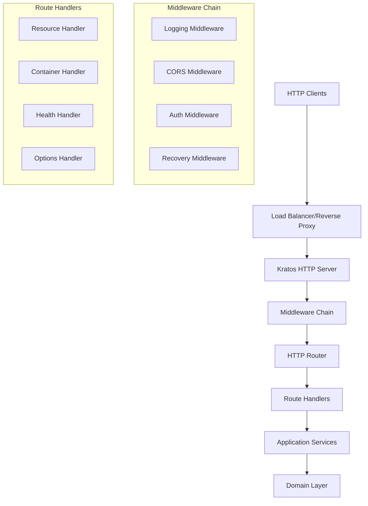

# Design Document: HTTP Server & Basic Routing

## Overview

The HTTP Server & Basic Routing feature provides the foundational web server infrastructure for the Solid pod server using the Go-Kratos framework. This design implements a clean architecture approach with proper separation of concerns, middleware support, and extensible routing capabilities that will serve as the foundation for all Solid protocol operations.

The design leverages Kratos v2.8.0's HTTP transport layer while maintaining compliance with HTTP/1.1 and HTTP/2 standards, providing robust request handling, middleware composition, and graceful shutdown capabilities.

## Architecture

### High-Level Architecture



### Component Architecture

The HTTP server will be structured using clean architecture principles:

- **Transport Layer**: Kratos HTTP server with middleware chain
- **Handler Layer**: HTTP request handlers that convert HTTP requests to application calls
- **Application Layer**: Business logic orchestration (future implementation)
- **Domain Layer**: Core business entities and rules (future implementation)
- **Infrastructure Layer**: External dependencies and configurations

## Components and Interfaces

### 1. HTTP Server Component

**Location**: `internal/infrastructure/transport/http/server.go`

```go
type Server struct {
    httpServer *http.Server
    router     *mux.Router
    middleware []Middleware
    config     *Config
    logger     log.Logger
}

type Config struct {
    Port            int
    ReadTimeout     time.Duration
    WriteTimeout    time.Duration
    ShutdownTimeout time.Duration
    TLSConfig       *tls.Config
}
```

**Responsibilities**:
- Initialize and configure Kratos HTTP server
- Manage server lifecycle (start, stop, graceful shutdown)
- Register middleware and routes
- Handle HTTP/1.1 and HTTP/2 protocols

### 2. Router Component

**Location**: `internal/infrastructure/transport/http/router.go`

```go
type Router interface {
    GET(path string, handler HandlerFunc, middleware ...Middleware)
    POST(path string, handler HandlerFunc, middleware ...Middleware)
    PUT(path string, handler HandlerFunc, middleware ...Middleware)
    DELETE(path string, handler HandlerFunc, middleware ...Middleware)
    PATCH(path string, handler HandlerFunc, middleware ...Middleware)
    HEAD(path string, handler HandlerFunc, middleware ...Middleware)
    OPTIONS(path string, handler HandlerFunc, middleware ...Middleware)
    Group(prefix string, middleware ...Middleware) *RouterGroup
}

type HandlerFunc func(ctx context.Context, req *http.Request) (*http.Response, error)
```

**Responsibilities**:
- Route HTTP requests to appropriate handlers
- Support path parameters and wildcards
- Handle method-specific routing
- Provide route grouping capabilities

### 3. Middleware System

**Location**: `internal/infrastructure/transport/http/middleware/`

```go
type Middleware func(HandlerFunc) HandlerFunc

type MiddlewareChain struct {
    middlewares []Middleware
}

func (mc *MiddlewareChain) Use(middleware ...Middleware)
func (mc *MiddlewareChain) Handler(handler HandlerFunc) HandlerFunc
```

**Core Middleware Components**:
- **Logging Middleware**: Request/response logging with structured output
- **Recovery Middleware**: Panic recovery and error handling
- **CORS Middleware**: Cross-origin resource sharing support
- **Timeout Middleware**: Request timeout handling
- **Metrics Middleware**: Performance monitoring (future)

### 4. Handler Registry

**Location**: `internal/infrastructure/transport/http/handlers/`

```go
type HandlerRegistry struct {
    handlers map[string]map[string]HandlerFunc
    logger   log.Logger
}

func (hr *HandlerRegistry) Register(method, path string, handler HandlerFunc)
func (hr *HandlerRegistry) GetHandler(method, path string) (HandlerFunc, bool)
```

**Standard Handlers**:
- **Health Handler**: Server health checks (`GET /health`)
- **Options Handler**: CORS preflight and method discovery
- **Not Found Handler**: 404 responses for unmatched routes
- **Method Not Allowed Handler**: 405 responses for unsupported methods

## Data Models

### HTTP Request Context

```go
type RequestContext struct {
    RequestID   string
    Method      string
    Path        string
    Headers     http.Header
    QueryParams url.Values
    PathParams  map[string]string
    Body        io.ReadCloser
    StartTime   time.Time
}
```

### HTTP Response Model

```go
type Response struct {
    StatusCode int
    Headers    http.Header
    Body       []byte
    Error      error
}
```

### Server Configuration

```go
type ServerConfig struct {
    HTTP HTTPConfig `yaml:"http"`
    Log  LogConfig  `yaml:"log"`
}

type HTTPConfig struct {
    Port            int           `yaml:"port" default:"8080"`
    ReadTimeout     time.Duration `yaml:"read_timeout" default:"30s"`
    WriteTimeout    time.Duration `yaml:"write_timeout" default:"30s"`
    ShutdownTimeout time.Duration `yaml:"shutdown_timeout" default:"10s"`
    MaxHeaderBytes  int           `yaml:"max_header_bytes" default:"1048576"`
    TLS             TLSConfig     `yaml:"tls"`
}

type TLSConfig struct {
    Enabled  bool   `yaml:"enabled" default:"false"`
    CertFile string `yaml:"cert_file"`
    KeyFile  string `yaml:"key_file"`
}
```

## Error Handling

### Error Types

```go
type HTTPError struct {
    Code    int    `json:"code"`
    Message string `json:"message"`
    Details string `json:"details,omitempty"`
}

func (e *HTTPError) Error() string
func NewHTTPError(code int, message string) *HTTPError
```

### Error Handling Strategy

1. **Panic Recovery**: Middleware catches panics and returns 500 Internal Server Error
2. **Structured Errors**: All errors include HTTP status codes and structured messages
3. **Error Logging**: All errors are logged with request context and stack traces
4. **Client-Safe Errors**: Internal errors are sanitized before sending to clients

### Standard Error Responses

- `400 Bad Request`: Malformed requests, invalid parameters
- `404 Not Found`: Resource or route not found
- `405 Method Not Allowed`: HTTP method not supported for resource
- `500 Internal Server Error`: Server-side errors and panics
- `503 Service Unavailable`: Server overload or maintenance mode

## Testing Strategy

### Unit Testing

1. **Server Component Tests**:
   - Server lifecycle (start, stop, graceful shutdown)
   - Configuration validation
   - Middleware registration and execution order

2. **Router Tests**:
   - Route matching and parameter extraction
   - Method-specific routing
   - Route precedence and conflict resolution

3. **Middleware Tests**:
   - Individual middleware functionality
   - Middleware chain composition
   - Error handling and recovery

4. **Handler Tests**:
   - Request/response processing
   - Error handling and status codes
   - Content negotiation

### Integration Testing

1. **HTTP Server Integration**:
   - End-to-end request processing
   - Multiple concurrent requests
   - Graceful shutdown with active connections

2. **Middleware Integration**:
   - Complete middleware chain execution
   - Cross-cutting concern handling
   - Performance impact measurement

### Performance Testing

1. **Load Testing**:
   - Concurrent request handling
   - Memory usage under load
   - Response time distribution

2. **Stress Testing**:
   - Server behavior at capacity limits
   - Graceful degradation
   - Resource cleanup

## Implementation Considerations

### Kratos Framework Integration

- Utilize Kratos HTTP transport for server foundation
- Leverage Kratos middleware system for cross-cutting concerns
- Integrate with Kratos logging and metrics systems
- Use Kratos configuration management for server settings

### Performance Optimizations

- Connection pooling and keep-alive support
- Request/response buffer pooling
- Efficient route matching algorithms
- Minimal memory allocations in hot paths

### Security Considerations

- TLS/HTTPS support with configurable cipher suites
- Request size limits to prevent DoS attacks
- Header size limits and validation
- Secure default configurations

### Monitoring and Observability

- Structured logging with request correlation IDs
- HTTP metrics (request count, duration, status codes)
- Health check endpoints for load balancers
- Graceful shutdown with connection draining

This design provides a solid foundation for the Solid pod server's HTTP infrastructure while maintaining flexibility for future enhancements and Solid protocol-specific features.